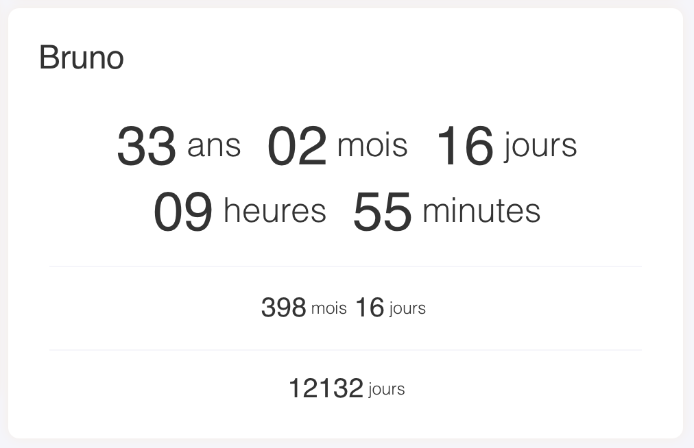

# Lovelace Nonow Age

A custom [Lovelace](https://www.home-assistant.io/lovelace/) component for displaying a age for [Home Assistant](https://github.com/home-assistant/home-assistant).

Current version: **0.0.1**

## Screenshots



## Install

### Simple install

1. Download and copy [lovelace-nonow-age.js](https://raw.githubusercontent.com/brunosabot/lovelace-nonow-age/master/lovelace-nonow-age.js) into your `config/www` directory.

2. Add a reference to `lovelace-nonow-age.js` inside your `ui-lovelace.yaml`.

```yaml
resources:
  - url: /local/lovelace-nonow-age.js?v=0.0.1
    type: module
```

### Installation using Git

**Clone this repository into your `config/www` folder using git.**

```console
$ git clone https://github.com/brunosabot/lovelace-nonow-age.git
```

**Add a reference to the card in your `ui-lovelace.yaml`.**

```yaml
resources:
  - url: /local/lovelace-nonow-age/lovelace-nonow-age.js?v=1
    type: module
```

## Updating

1. Find your `lovelace-nonow-age.js` file in `config/www` or wherever you ended up storing it.

2. Replace the local file with the latest one attached in the here: [lovelace-nonow-age.js](https://raw.githubusercontent.com/brunosabot/lovelace-nonow-age/master/lovelace-nonow-age.js).

3. Change the version number with the new one to the end of the cards reference url in your `ui-lovelace.yaml` like below.

```yaml
resources:
  - url: /local/lovelace-nonow-age.js?v=0.0.2
    type: module
```

_You may need to empty the browsers cache if you have problems loading the updated card._

## Using the card

### Options

#### Card options

entity: input_datetime.bruno_birth
title: Bruno
type: 'custom:lovelace-nonow-age'

| Name   | Type    | Default      | Since  | Default | Description                  |
| ------ | ------- | ------------ | ------ | ------- | ---------------------------- |
| type   | string  | **required** | v0.0.1 |         | `custom:lovelace-nonow-age`  |
| entity | string  | **required** | v0.0.1 |         | An input_datetime **entity** |
| title  | integer | optional     | v0.0.1 | Age     | The card title               |

### Example usage

#### Simple usage

```yaml
- type: custom:lovelace-nonow-age
  entity: input_datetime.bruno_birth
```

#### Advanced configuration

```yaml
- type: custom:lovelace-nonow-age
  entity: input_datetime.bruno_birth
  title: Nonow's age
```

## License

This project is under the MIT licence
